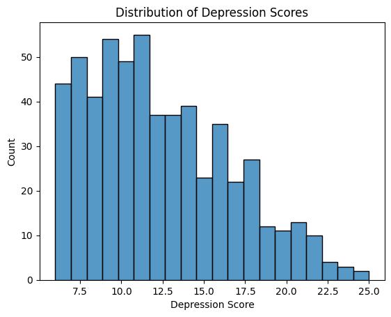
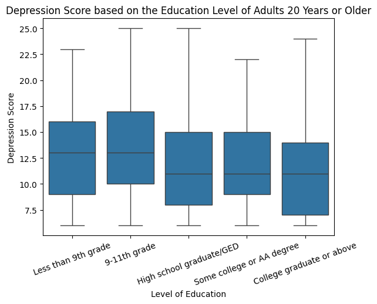
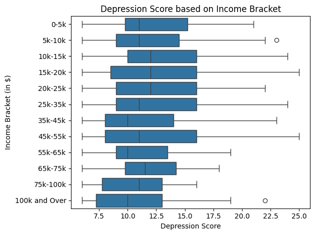
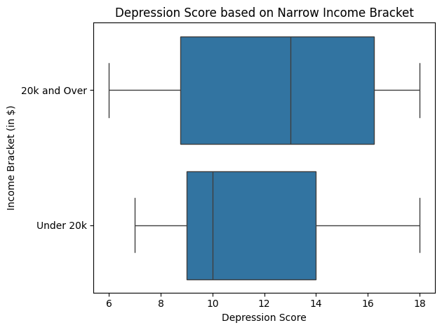
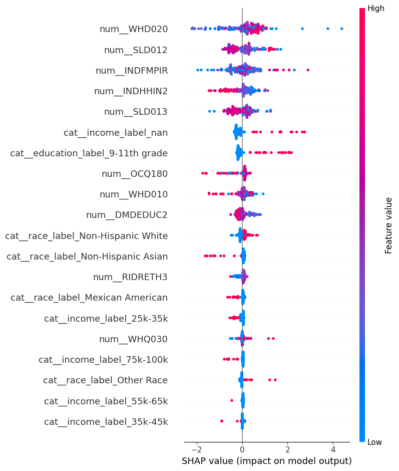
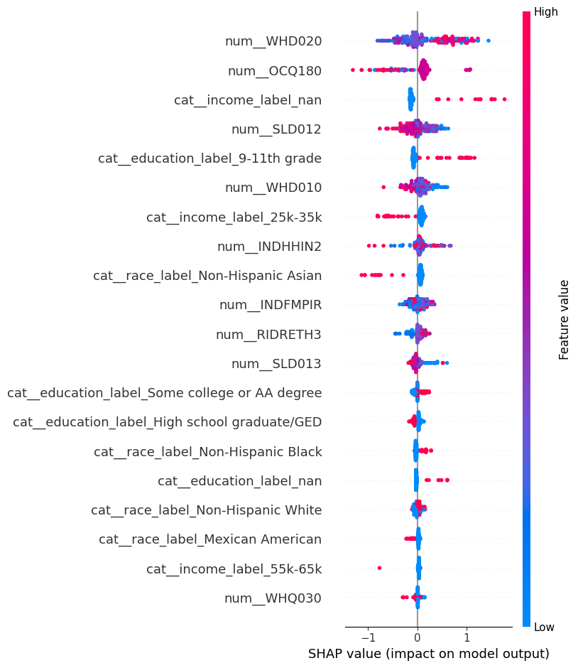

# Introduction/Data

## Topic

Our area of research is predicting depression score based on demographics, income, weight, working hours, and sleep.

## Motivation

One of the most challenging health crises facing our world today is the mental health epidemic. From August 2021 - August 2023, the CDC reported that 13.1% of U.S. adolescents and adults over the age of 12 struggle with depression, with the highest prevalence observed among teenagers and adolescents. We wanted to determine if and how factors such as income, sleep, hours worked each week, and demographics like race, gender, and level of education correlate to depression diagnosis. 

## Research Question:
What impact, if any, do different demographics, sleep behaviors, incomes, body weights, and hours worked each week have on predicting depression score?

## Data Source - CDC’s NHANES Survey

We sourced our data from the CDC because it produces annual reports on many different health conditions and statistics in the U.S., including depression, and it is the United States’ main public health organization, so its data should be credible. Specifically, we picked the 2017-2018 data because it was the most accessible and complete data. NHANES stands for the National Health and Nutrition Examination Survey. Additionally, depression score is a metric that the CDC uses to determine population-level depression prevalence, and it is an aggregation of scores from 0-3 that capture the severity of one of nine depression symptoms. Although the CDC calculates a depression score, it was not recorded in the NHANES dataset, so we calculated it by aggregating the scores for each of the 9 predictors. Lastly, given that NHANES is a survey, it is not a formal depression diagnosis. However, it is intended to give population-level estimates of the prevalence of different depression symptoms.

## Disclaimer
We are not psychiatry or psychology professionals, and all results are for the purpose of finding patterns to guide the course of future research, not to diagnose real people.
 

# Methodology

## EDA

### Outcome Variable

Depression score: We calculated this by aggregating the scores from DPQ010-DPQ090, which measured the severity of a participant’s experience of a depression symptom. It is a good proxy for depression diagnosis because it is the exact criteria the CDC uses to estimate the prevalence of depression across the population.

### Key Explanatory Variables (EDA)

Our key explanatory variables were race (RIDRETH3 and race_label), income (‘INDHHIN2’ / ‘income_label’), hours worked last week (OCQ180), and level of education (DMDEDUC2 / education_label). We also included sleep-related variables such as weekday sleep hours (SLD012), weekend sleep hours (SLD013), perception of weight (WHQ030), and BMI (computed from WHD010 and WHD020).

### Data Cleaning

We had to clean the data by replacing any depression symptom indicator that was not between 0 and 3 with a NaN, so the scores could only reach a maximum of 27 (which is the maximum score for depression screening in the NHANES). We also cleaned explanatory variables by converting them to numeric and replacing NHANES special codes, such as 77777 and 99999 in OCQ180, and 77 and 99 in sleep variables like SLD012 and SLD013, with NaN.

### Data Wrangling

We wrangled the data by performing an inner merge of all 4 raw datasets by SEQN number. We chose an inner merge because we wanted to have the most data per row possible, even if it meant dropping some participants. We also dropped all of the variables we did not need from the raw data by choosing to only keep the subset that we did need, including OCQ180, SLD012, SLD013, WHQ030, WHD010, WHD020, and depression_score.

### Dropped/Excluded Observations:

We excluded any observations that have NaN for depression_score since it is our key outcome variable, and if a participant does not have that score calculated, that participant is not useful for this data analysis. We also excluded any participants who did not answer at least 6 of the 9 depression indicator questions because we wanted to minimize skewing the data to the left due to participants simply answering fewer questions. In addition, we excluded invalid or missing values in the explanatory variables such as OCQ180, SLD012, SLD013, WHD010, and WHD020.

### New Variables Created:

In addition to depression_score, we created new variables for any of the encoded categorical variables, such as income or race, because the encoded values were hard to interpret without looking at the dataset’s codebook. We also created BMI using WHD010 and WHD020 using the formula 703 * (WHD020 / WHD010^2).

### Highlights from EDA

Based on the histogram, the most common depression scores appeared to be from about 10-12.5. Additionally, the histogram is skewed right, which indicates that there is an observable minority of participants with a depression score greater than or equal to 12.5 (as there is no observed score above 25). Despite the skew, the majority of participants have a relatively low depression score.

It appears that those who have graduated high school (or the equivalent) or have received a higher level of education have a substantially lower median depression score than those who have not reached this level of education. While the median depression score of those with less education than the equivalent of a high school degree is about 13, it is only about 10.5 for those who have received the equivalent of a high school education or higher.

It appears that those whose households make 35,000 to 44,999, 55,000 to 64,999, 100,000 and over, and under 20,000 dollars have a substantially lower median depression score than those who make any other quantity of money. These results are fascinating because the trend that a higher household income is correlated with a lower depression score is challenged by the fact that the median depression score for those whose household income is 20,000 dollars and over is much smaller than that of those who make under 20,000 dollars, with the former and latter levels having median depression scores of approximately 10.5 and 13 respectively. Additionally, participants whose household income ranges from 0 to 54,999 dollars have a much higher spread of depression scores than those who make 55,000 dollars or more a year, suggesting that the range of depression scores decreases as income increases once the 55,000 dollar threshold is reached.

## Models Created

For our analysis, we created a linear regression model, LASSO model, and neural network model using race (RIDRETH3), gender (RIAGENDR), ratio of income to the poverty line (INDFMPIR), average weekday sleep (SLD012), and average weekend sleep (SLD013) as predictors and depression score as our outcome. The only one of these variables we didn’t explore in our EDA was the ratio of the participant’s income to the poverty line, but we thought that this would be a good predictor to model the surprising relationship we found between depression score and annual household income for those who made over and under $20,000 per year. We wanted to create a linear model to determine whether there is an obvious relationship between our predictors and depression score before using more advanced analysis methods. We used LASSO because it is a good way to prevent overfitting while still using a relatively simple model. We then used a neural network to determine if a model could predict depression score relatively accurately based on our selected factors, using it as a pressure test to see if our hypothesized predictors were strong enough to depict depression score. Lastly, we used gradient boosting on all possible predictor variables (i.e., anything in the codebook aside from sequence number, depression indicator question scores, and depression score) to determine if we overlooked a metric during EDA that substantially impacted depression score.

<!-- TODO: Tony, is this what the purpose of our gradient boosting was? Feel free to edit if not or if you have more to say. -->

### Visualization of Gradient Boosting

#### Regression Model

{width=75%}

#####  Classificaition Model

{width=75%}

# Results

### Performance of the Models

<!-- TODO: Tony -->

# Discussion

<!-- TODO: Tony -->

# Conclusion

To conclude, our predictor variables did not strongly predict depression score. Although the results of our EDA suggested possible relationships between income, education, and depression score, our models performed worse on average than guessing the mean depression score. Therefore, our models demonstrated that our predictors are not strong enough to conclude that there is a strong relationship between our selected predictor variables and depression score. We aren’t claiming that our predictor variables have no impact on depression score, but our models show they aren’t influential enough on their own to predict it. The main focus of any future work would be to see how our models (especially the neural network) perform when used on data outside of 2017-2018, and outside of the US. Additionally, we would increase our subset of predictor variables to see if there are any stronger correlations between other demographics we missed, or even other health conditions and depression score. Lastly, we would want to find another metric for calculating the severity of depression across the population other than the NHANES’ metrics and see if the same predictor variables are correlated with depression score.

